# WaveCalling

WaveCalling helps you **turn raw kymographs into quantitative, browsable wave statistics**.  
It builds on the original KymoButler idea but swaps in a modern, **Python/ONNX** pipeline and a small web app so you can upload images (or tables that auto-convert to heatmaps), run analyses, and explore the results **without touching Mathematica**.

What you get:
- **Segmentation → skeletonization → crossing-aware tracking → refinement/merging** (ONNX + Python).
- **Per-track & per-wave metrics** (frequency, period, amplitude, velocity, wavelength) exported to CSV.
- An **overlay JSON** and viewer to inspect traces, filter by metrics, and open per-track thumbnails/plots.
- A lightweight **FastAPI** backend that streams **live progress** (Server‑Sent Events) and serves artifacts.

> In-development demo: `waves.rohitmahesh.net` (Cloud Run).

---

## Pipelines 

The left diagram shows the original **Mathematica / WL** flow; the right is my **Python / ONNX** re‑implementation.

<table>
  <tr>
    <td style="vertical-align:top; width:50%; padding-right:12px;">
      <strong>Mathematica / WL</strong><br/>
      
    </td>
    <td style="vertical-align:top; width:70%; padding-left:12px;">
      <strong>Python / ONNX</strong><br/>
      
    </td>
  </tr>
</table>

---

## Quickstart (one command)

### 0) Install the basics
- **Git**  
  - macOS: usually preinstalled (or run `xcode-select --install`).  
  - Windows: install Git for Windows.  
  - Linux: `sudo apt install git` (or your distro’s package manager).
- **Docker Desktop** (macOS/Windows) or **Docker Engine** (Linux). Confirm it works:
  ```bash
  docker --version
  docker compose version
  ```
- **GitHub CLI (`gh`)** — needed so we can auto‑download sample data on first run:
  https://cli.github.com/

### 1) Get the code
```bash
git clone https://github.com/rohitmahesh1/WaveCalling.git
cd WaveCalling
```

### 2) (Optional) Set a session secret
To isolate runs between browser tabs you can add a secret:
```bash
python - <<'PY'
import secrets; print(secrets.token_hex(32))
PY
```
Create a file named `.env` in the repo root and paste:
```
SESSION_SECRET=<paste-the-64-hex-string>
```

### 3) Run the app (and fetch samples automatically)
```bash
make up
```
- The **first run** will download example data into `./samples` via the GitHub CLI, then build and start the stack.
- Open **http://localhost:8080**.  
- Runs and outputs are persisted to `./runs` on your machine.

**Handy make targets**
```bash
make down          # stop the stack
make rebuild       # rebuild (no cache) + start
make samples       # (re)download sample assets
make clean-samples # wipe samples/ (keeps .gitkeep)
```

---

## Tuning the pipeline (edit `configs/default.yaml`)

You control the ML/processing parameters in **`configs/default.yaml`**. Edit locally; changes are picked up on the next start (Compose mounts `./configs:/app/configs:ro`).

> Tip: keep your custom settings in a copy like `configs/my_experiment.yaml` if you want to try variants.

---

## What’s in the box

- **Frontend**: React + Vite app (built into the image and served by the API).
- **API**: FastAPI service with Server‑Sent Events for live progress and simple JSON/static endpoints for artifacts.
- **Core pipeline**: ONNX KymoButler‑style segmenter + Python tracker and decision module + metrics and overlay composer.
- **Data & outputs**: Each run writes to `./runs/<run_id>/…` (metrics CSVs, overlay JSON, tracks, debug plots).

---

## Docker Compose (for reference)

You don’t need to edit this to get started — `make up` wraps it for you — but this is the stack under the hood:

```yaml
name: waves
services:
  api:
    image: waves-local
    build:
      context: .
      target: backend          # final Python stage from multi-stage Dockerfile
    container_name: waves-api
    ports:
      - "${PORT:-8080}:8080"
    environment:
      PORT: "8080"
      STORAGE: "local"
      RUNS_DIR: "/app/runs"
      DEFAULT_CONFIG: "/app/configs/default.yaml"
      SAMPLES_DIR: "/app/samples"
      WEB_DIR: "/app/web"
      ALLOW_ORIGINS: "http://localhost:8080,http://localhost:5173"
      ALLOW_CREDENTIALS: "true"
      SESSION_SECRET: "${SESSION_SECRET:-dev-secret}"   # optional for local
      SESSION_HTTPS_ONLY: "false"
      SESSION_SAMESITE: "lax"
      LOG_LEVEL: "INFO"
    volumes:
      - ./runs:/app/runs
      - ./configs:/app/configs:ro
      - ./samples:/app/samples:ro   # sample assets downloaded by the script
    restart: unless-stopped
```

---

## Troubleshooting

- **The page loads but I don’t see my run after a refresh**  
  Your browser session owns the run (cookies). Use the same tab, or set a real `SESSION_SECRET` in `.env` and restart.
- **CORS errors in the browser console**  
  For local work, keep `ALLOW_ORIGINS` as shown. 
- **Nothing on port 8080**  
  Ensure Docker is running. Then try `make rebuild` or `make down && make up`.
- **No samples show up**  
  `make up` downloads them automatically on first run. If `gh` wasn’t installed then, install it and run `make samples`.